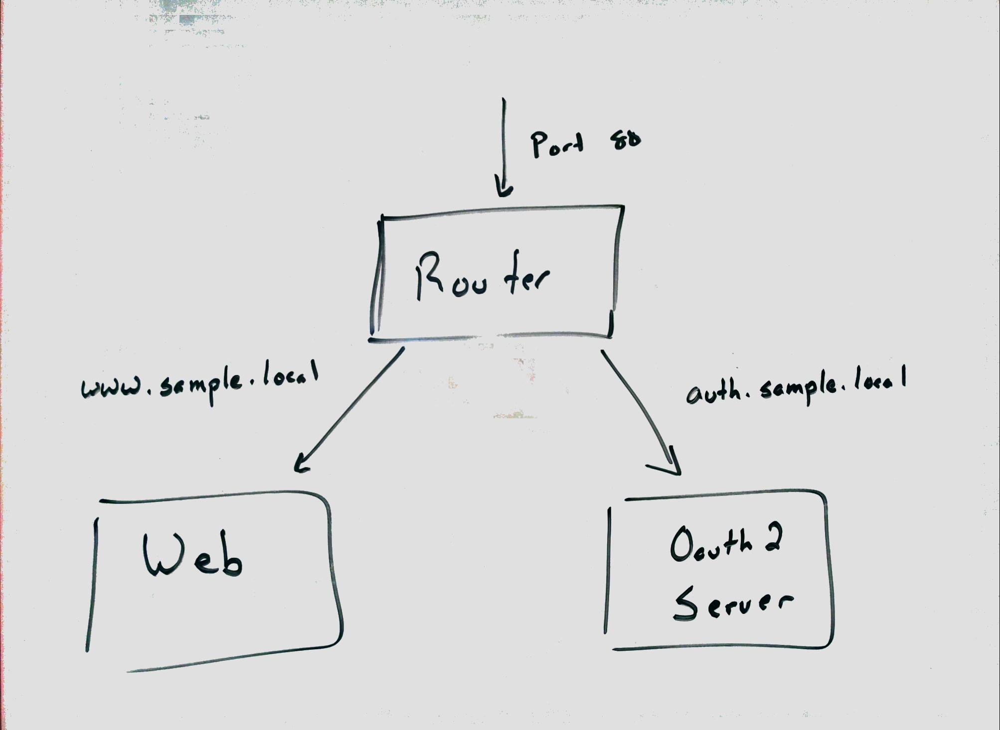

# service-experiment

Three containers are used in this sample to create a web site that allows login using OAuth2.  The web site and OAuth2 servers are both running in containers that are exposed by a third routing container.



Requests to the router are submitted to the Router container via port 80/443 which is mapped to the host.  If the host name is https://www.sample.local, the requests are mapped to the Web container.  If the host name is https://auth.sample.local, the requests are mapped to the OAuth2 Server container.

The relationships between the containers are encoded in the fig.yml file used by [Fig](http://www.fig.sh/).

```yaml
router:
  build: ./router
  ports:
    - "80:80"
    - "443:443"
  links:
    - "web:servers_web_01"
    - "auth:servers_auth_01"
web:
  build: ./web
  links:
    - "auth:auth.sample.local"
auth:
  build: ./auth-server
```

## Setup

To run this sample, you'll need a Linux installation running [Docker](https://docs.docker.com/installation/ubuntulinux/) and [Fig](http://www.fig.sh/install.html).

The two URLs need to be added to the `/etc/hosts` file.

```
127.0.0.1 www.sample.local
127.0.0.1 auth.sample.local
```

To run the sample, build and start the containers open a terminal, navigate to the **integration** folder containing **fig.yml**, and run `fig -d up`.  This will start the containers.

## Exploring the Sample

The initial entry point is https://www.sample.local.  You'll need to ignore certificate warnings from your browser since this is a self signed certificate.

Log on to the site by clicking the Login link.  Use one of the passwords shown at the bottom of the page to log in then allow access.  You should be redirected to the main page and see that a new link is now available.

## Certificate creation

This is the script used to create the certificates

``` bash
openssl genrsa 2048 > sample.local.key
openssl req -new -x509 -nodes -sha1 -days 3650 -key sample.local.key > sample.local.cert
#[enter *.domain.com for the Common Name]
openssl x509 -noout -fingerprint -text < sample.local.cert > sample.local.info
cat sample.local.cert sample.local.key > sample.local.pem
chmod 400 sample.local.key sample.local.pem
```

## Development patterns

When working on the web site, dependent services are needed.  One solution would be to manually run the node server and start the redis container manually.  This has the overhead of extra steps and the knowledge of which services need to be started.  The solution used in this project is to use the fig.yml file in the root directory to start all the services in a development mode, then stop the one you want to work on.  Now you can develop using node natively and have it interact with the services.

To make this happen, the following conditions are required:
 - The dev containers need to run on the host network
 - The ports for all services need to default to a set of default ports
 - The developer needs to understand which services to stop using `fig stop ...` to start their development
 - A different **fig.yml** file is needed for development and integration tests

I don't like this solution as it requires multiple **fig.yml** files in different configurations, but I don't have a better solution.  The big limiting factor is that if I run node.js outside of containers, then it can't use the links, which forces the other containers outside of the container's isolated network.

Some possible improvements are:
 - Have a specific **fig.yml** file for each service that will pull in it's dependencies.  What I don't like about this is that a container's details are encoded in multiple locations