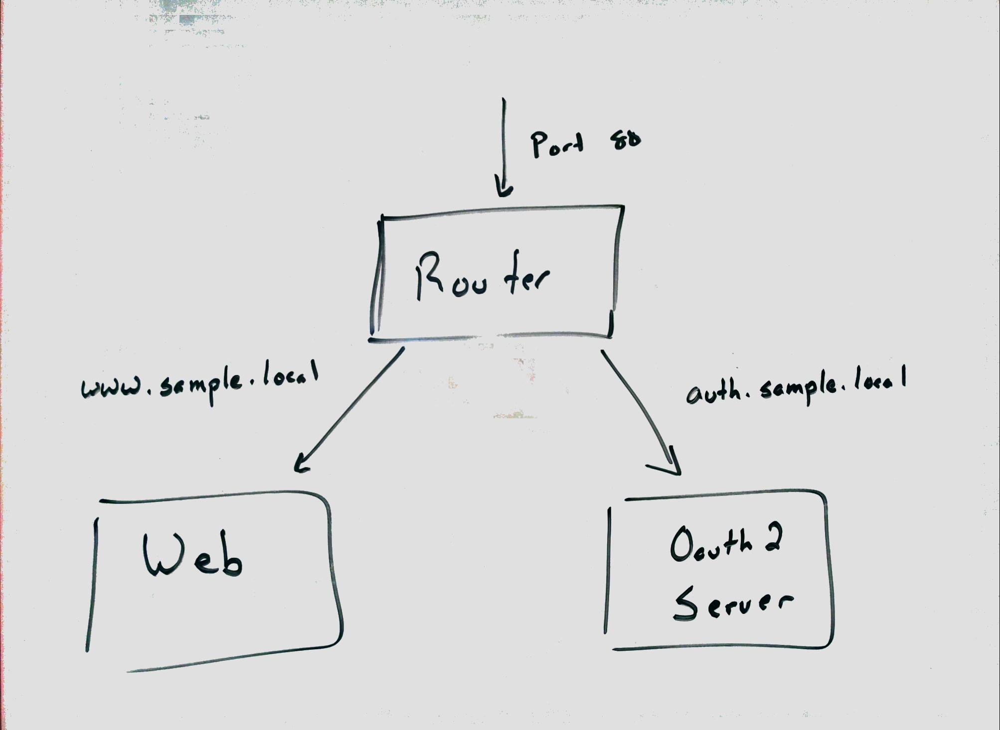

# Container Layout

This sample is made up of two key services, the website and the OAuth2 server, which are supported by a router and session store service.  Incoming requests are sent to the router, which routes to either the website or the OAuth2 server based on the host name.  This creates a system with a single external access point that can theoretically delegate to a set of website or OAuth2 server instances.  

Login is handled using the OAuth2 protocol.  When a request is made to the website and the user is not logged in, they are redirected to the OAuth 2 server to begin a request for an access token using the [Authorization Code Flow](https://www.digitalocean.com/community/tutorials/an-introduction-to-oauth-2).  This requires that user authenticate on the OAuth2 server which sends a code back to the website.  The website then requests an access token from the OAuth2 server which is then used to read the user's profile.  From this point on the profile is stored in the website's session to avoid the need to repeat the authorization flow.

Since there is the possibility of multiple website or OAuth2 server instances, a shared session store is needed.  In this sample Redis is used in it's own container.



## Managing Container Instantiation

Since we have multiple docker containers to be created for our system to work successfully, running them from the command line using the `docker` command would be tedious and error prone.  To script this a tool called [Fig](http://www.fig.sh) is used.  Fig uses a config file to define a list of containers to create and link together to create the system.

```yaml
router:
  build: ../router
  ports:    
    - "443:443"
  links:
    - "auth"
    - "web"    
sessionstore:
  image: redis
  ports:
    - "6379:6379"  
auth:
  build: ../auth-server
  links:
    - "sessionstore:sessionstore"
  environment:
    PORT: 80
web:
  build: ../web
  links:
    - "auth:auth.sample.local"
    - "sessionstore:sessionstore"
  environment:
    PORT: 80
    AUTH_URL: "https://auth.sample.local/dialog/authorize"
    TOKEN_URL: "http://auth.sample.local/oauth/token"
    CALLBACK_URL: "https://www.sample.local/auth/login/callback"
    PROFILE_URL: "http://auth.sample.local/api/userinfo"
```

This configuration creates 4 docker instances.  The router section defines a router that's exposed to the host through port 443 for HTTPS communication.  This is the only container that's connected to the outside world.  The rest of the communication happens within docker's private network.  The router needs to communicate with the website and OAuth2 server containers, so the fig.yml file defines these relationships in the **links** section of the file.  When fig starts the container instances, the IP addresses of the web and auth containers will be injected into the /etc/hosts file as well as environment variables for the services to use.

The next container to start is the session store.  It's being exposed to the host via port 6379 so it can be accessed from the host for inspection purposes only.

The auth container is linked to this session store using a docker link that enters the IP address into the containers environment variables list.  **I'd like to just use the /etc/hosts file entry, but this would require me to force the developers to make the same entry in their /etc/hosts file to effectively develop.  This is discussed more in the section of developing services.**

The web container is the most complicated configuration since it needs the OAuth2 server locations to be configured and it needs to be linked to the auth container.  This leads to two problems.  The first is that by connecting to the container directly, we're limited to a single OAuth2 server, or we'll need a load balancer between the website and the OAuth2 server instances.  The second is that since we're talking directly to the OAuth2 server and the router is our HTTPS terminator, the protocol when connecting directly to the OAuth2 server is HTTP, not HTTPS.  This leads to the need to define all of the OAuth2 parameters manually in environment variables.

**I suspect that the better solution to this problem is to think of the website and OAuth2 servers separately and isolate them behind multiple routers (or no router when developing)**
